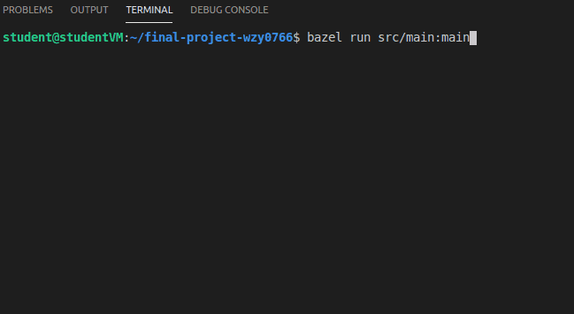
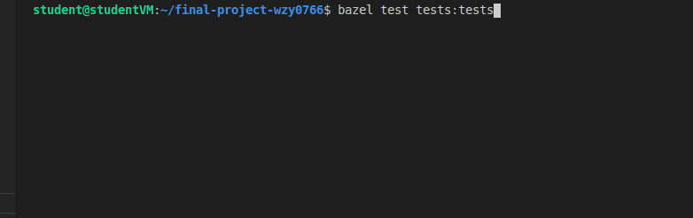
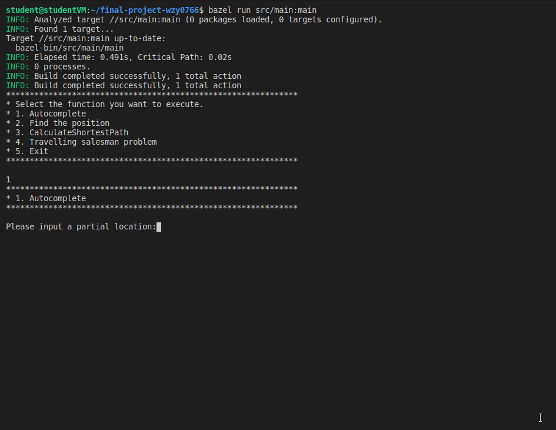
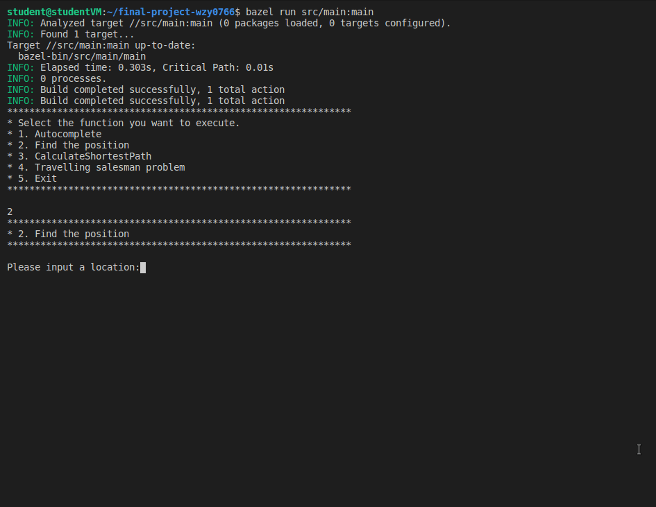
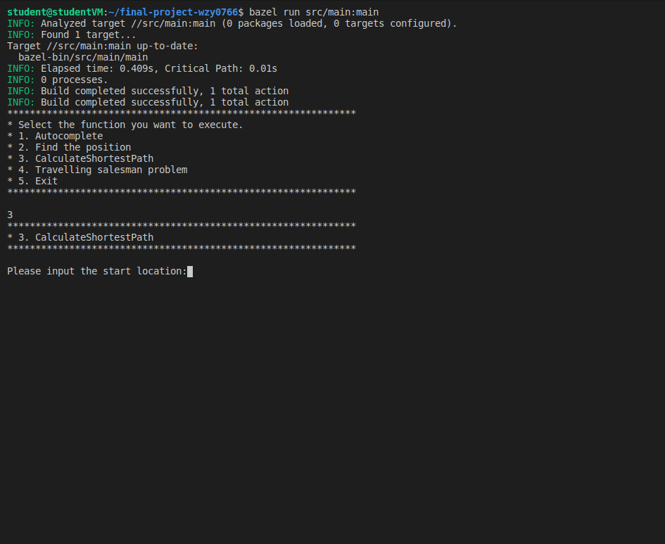
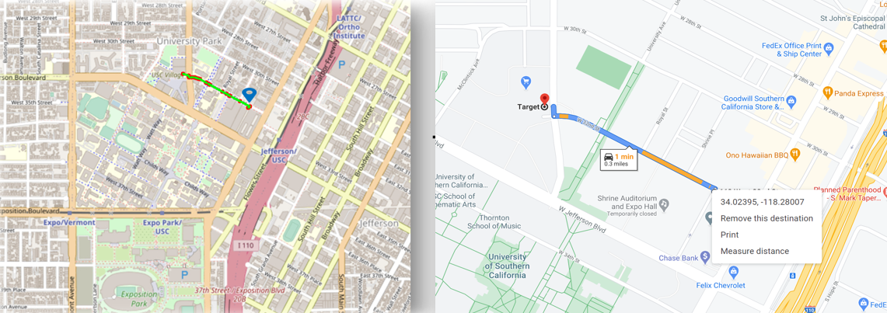
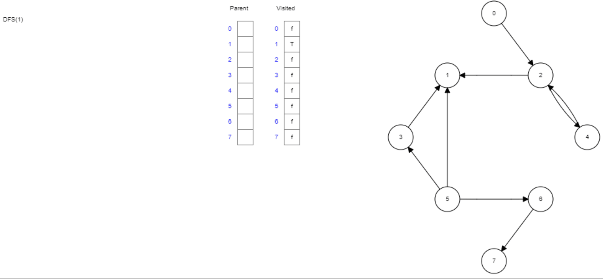
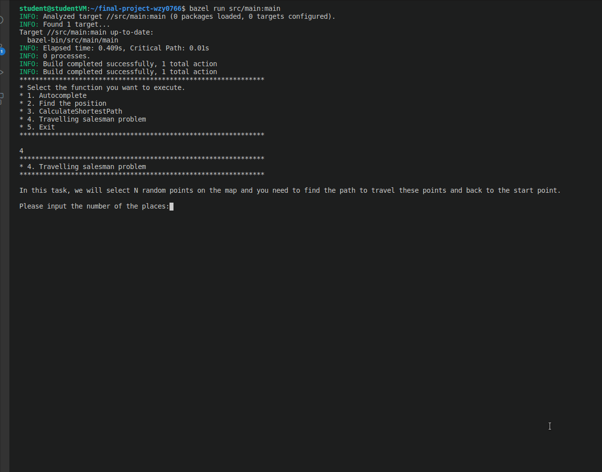

# EE599 Final Project - Trojan Map
Instructor: [Arash Saifhashemi](https://viterbi.usc.edu/directory/faculty/Saifhashemi/Arash), Fall 2020, University of Southern California.

## Overview of Trojan Map

In this project, I built a mapping application based on STL data structures and graph search algorithms
, which can implement four major functionalities:
* Autofill the location full name for travelers
* Find the ground-truth position of the current point
* Calculate the best travel route between two locations
* Calculate best routes for travelers on a permutation of locations

### Simple Demo

<p align="center"></p>

---

## Data Structure

Each point on the map is represented by the class **Node** shown below and defined in [trojanmap.h](src/lib/trojanmap.h). Data is generated by [map.csv](src/lib/map.csv) and extracted by using [OpenCV](https://hackmd.io/fx5je9R0T_GewLxE3xF7zQ#OpenCV-Installation).

```cpp
class Node {
  public:
    std::string id; // A unique id assigned to each point
    double lat;     // Latitude
    double lon;     // Longitude
    std::string name; // Name of the location. E.g. "USC Fisher Museum of Arts".
    std::vector<std::string> neighbors; // List of the ids of all neighbor points.
  private:
    std::map<std::string, node> data; // A map of ids to Nodes.
};
```
All types of navigation information are stored in a mapped fashion that provides advantages over **std::string** (an array of chars) and **std::vector** (arrays), here are lists of **advantages**:

* **Lookup Time** 
    
    If we’ve already known the key of a certain value on the map, we can easily look up the certain value that we want to extract with average time complexity of O(log(n)), for example:
    * **data[id].lat** // Access latitude data of current id
    * **data[id].name** // Access name data of current id
    * **data[id].neighbors** // Access neighbors of current id
       
* **Sorted Order** 
    
    [std::map](https://www.geeksforgeeks.org/map-associative-containers-the-c-standard-template-library-stl/) also can store associated values in sorted key order. It's convenient to traversed all elements from the beginning to the end with the help of member functions of map, such as:
        ```
        map::find, map::begin, map::end, map::size, map::insert, etc.
        ```

* **Hash Table**
    
    * [std::unordered_map](https://www.geeksforgeeks.org/unordered_map-in-cpp-stl/) can significantly improve the lookup performance with an average cost of **search**, **insert**, and **delete**. The time complexity is generally O(1).
    * On top of that, std::unordered_map keys can be stored in any ordered whereas std::map keys is an ordered sequence (like [std::set](https://www.geeksforgeeks.org/set-in-cpp-stl/)).

---

### **Tools & Platforms**
Oracle VirtualBox, Ubuntu VM, Visual Studio Code, Bazel, GTest, OpenCV, CMake.


## **Steps to run the program**
Please clone this repo on your computer (or virtual machine):
```shell
git clone https://github.com/ee599-20203/final-project-wzy0766.git
cd final-project-wzy0766/
```
### OpenCV Installation
For visualizations, I used [OpenCV](https://github.com/opencv/) and [Xming](https://sourceforge.net/projects/xming/) library as a black box on WSL Ubuntu.

Use the following commands to install OpenCV.

```shell
cd TrojanMap
git clone https://github.com/opencv/opencv.git
cd opencv/
mkdir build install
cd build
```


```shell
sudo apt-get install cmake libgtk2.0-dev pkg-config
sudo apt install libcanberra-gtk-module libcanberra-gtk3-module
```

Next, type the following, but make sure that you set the **path_to_install_folder** to be the absolute path to the install folder under opencv.(You may use ***pwd*** to find your own **path_to_install_folder**)

```shell
cmake -D CMAKE_INSTALL_PREFIX=**path_to_install_folder** -D BUILD_LIST=core,highgui,imgcodecs,imgproc,videoio  -D WITH_TBB=ON -D WITH_OPENMP=ON -D WITH_IPP=ON -D CMAKE_BUILD_TYPE=RELEASE -D BUILD_EXAMPLES=OFF -D WITH_NVCUVID=ON -D WITH_CUDA=ON -D BUILD_DOCS=OFF -D BUILD_PERF_TESTS=OFF -D BUILD_TESTS=OFF -D WITH_CSTRIPES=ON -D WITH_OPENCL=ON ..
make install
```

---
### Bazel Build

Please run:

```shell
export DISPLAY=:0
bazel run src/main:main
```

If everything is correct, this menu will show up.

<p align="center"></p>

### Google Test
Functionalities of the program will be tested via [GTest](https://github.com/google/googletest) & [Bazel](https://docs.bazel.build/versions/master/bazel-overview.html).

Please run:
```shell
bazel test tests::tests
```
<p align="center"></p>


## Feature 1: Autocomplete the location name

```c++
std::vector<std::string> Autocomplete(std::string name);
```

* Assumed the names of nodes as the locations. As we typed the location's partial name, a list of possible locations with the full name will be returned. Here uppercase and lower case are treated as the same character by using [std::tolower](https://www.tutorialspoint.com/how-to-convert-std-string-to-lower-case-in-cplusplus).

* To check if the input name matches the name in the database. We need first to call [std::substring](https://www.geeksforgeeks.org/substring-in-cpp/) to compare the two strings' size. The **time complexity** for this function is O(n) where n is the number of nodes.

Example:

Input: "USC" \
Output: ["USC Fisher Museum of Arts", "USC Village Gym", "USC Parking", "USC Dining Hall"]

<p align="center"></p>

## Feature 2: Find the place

```c++
std::pair<double, double> GetPosition(std::string name);
```

* Given a non-duplicate location name, return the latitude, longitude, and mark the map's locations. If the location does not exist, return (-1, -1).

* To check if the input_name is on the map, we need to loop through all the map elements and use an if_loop to filter satisfied elements as the output. The **time complexity** of this function is O(n) where n is the number of nodes.
* Helper functions ***GetLat*** and ***GetLon*** are used to extract values of latitude and longitude, respectively.

Example:

Input: "USC Parking" \
Output: (34.0239, -118.2800)

<p align="center"></p>

## Feature 3: CalculateShortestPath
Given 2 locations A and B on the map, find the best route from A to B.
```c++
std::vector<std::string> CalculateShortestPath(std::string location1_name,
                                               std::string location2_name);
``` 
* The distance between 2 points is the [euclidean distance](https://www.geeksforgeeks.org/program-calculate-distance-two-points/) using latitude and longitude. 
* [Dijkstra algorithm](https://www.geeksforgeeks.org/dijkstras-shortest-path-algorithm-using-priority_queue-stl/?ref=lbp) has been used to calculate the shortest path between two locations on the map with the help of [std::priority_queue](https://www.geeksforgeeks.org/priority-queue-in-cpp-stl/) and [boolean value](https://www.geeksforgeeks.org/bool-data-type-in-c/#:~:text=In%20C%2B%2B%2C%20the%20data,1%20and%20false%20is%200.). If there is no path, return an empty vector. 
* The **time complexity** of this function is O(ELogV)) as there will be at most O(E) vertices in std::priority_queue, and O(LogE) is the same as O(LogV).
```c++
* Initialize distances of all vertices as infinite;
* Create an empty priority_queue pq (weight, node); 
* Insert source vertex into pq and make its distance as 0;
* While (! pq.empty()) 
     * Extract minimum distance vertex from pq: 
     //Let the extracted vertex be curr_node; O(n*log(n))
     * Loop through all adjacent vertexes of curr_node:
	* For every vertex curr_node: //O(n)
	  * If dist[dest] > dist[curr] + weight(curr, dest)：
          //If there is a shorter path to dest through curr
               
               * (i) Update distance of dest: dist[dest] = dist[curr] + weight(curr, dest);
               * (ii) Insert dest into the pq;
```

Example:

Input: "USC Parking", "Target" \
Output:

<p align="center"></p>

## Comparison of TrojanMap & GoogleMap
<p align="center"></p>

## Feature 4: Computation of Travelling Trojan Problem (AKA [TSP](https://en.wikipedia.org/wiki/Travelling_salesman_problem))
* Assumed the map is a [complete graph](https://www.geeksforgeeks.org/graph-types-and-applications/), which means each location is a neighbor of all other locations.
* Given a vector of location ids, assume every location can reach every location in the list.
* The shortest route that covers all the locations and goes back to the start point. Return the shortest route and it will be converted to a animation.  

#### Brute Froce Approach: [DFS Recursion](https://www.geeksforgeeks.org/travelling-salesman-problem-implementation-using-backtracking/)
```c++
std::pair<double, std::vector<std::vector<std::string>>> TravellingTrojan(
      std::vector<std::string> &location_ids);
```
* Consider location 1 (0th node) as the starting and ending point.
* Traversed from the source to its adjacent location in [DFS](https://www.geeksforgeeks.org/depth-first-search-or-dfs-for-a-graph/) fashion.
```c++
DFS_helper(location_ids, results, bool visited, path, min_dist, dist)
    if locations_ids are in the path:
    //Calculate the dist(last node, penultimate node)
       if dist < min_dist:
	    results.first = dist;
	    results.second.push_back(path);
    //Time Complexity: O(V + E) where V is vertices and E edges
```
<p align="center"></p> 

Reference: [*****Data Structure Visualization*****](https://www.cs.usfca.edu/~galles/visualization/DFS.html)
* Calculate every traversal's cost, record the minimum cost, and update the value of the minimum cost stored value.
* Return the permutation with minimum cost.
* The time complexity of this function is O(n^2).
```c++
TSP(path, location_ids, results, bool visited)
min = infinity;
Path.push_back(visited_nodes);
Recursively call DFS; //T(n) = O(V + E)
Return results;
//Time Complexity: T(n) = O(V + E) * O(n) = O(n^2)
```
#### [2-opt Heuristic](https://en.wikipedia.org/wiki/2-opt). Also see [this video](https://www.youtube.com/watch?v=dYEWqrp-mho&feature=youtu.be)
```c++
std::pair<double, std::vector<std::vector<std::string>>> TravellingTrojan_2opt(
      std::vector<std::string> &location_ids);
```
* 2-opt may **not** always find the best result, and it needs a base case to implement greedy nearest neighbor algorithms.
* 2-opt is way faster than the brute force in terms of run time, especially if the input N is greater than 10.
* The **time complexity** of this function is O(n*x), where x is the times of non_improvments defined by users.

I randomly selected N points in the map and run the program. Example: 

When N = 10, one possible output animation shown below:

<p align="center"></p>

<p align="center"></p>

## Conclusion
In this project, I constructed a backend map application for users to navigate around the USC campus. I used some basic STL libraries such as queue, array, list, and iterator, etc. I implemented graph search algorithms, classical sorting algorithms, generated reasonable Google unit tests, and further demonstrated the traveling salesperson computation with animations.
## Further works
Bellman-Ford algorithms will optimize the run-time complexity as an alternative method to calculate the shortest path. Similarly, the 3-opt heuristic will also improve TSP algorithms' performance and thus reduce the run time complexity.
# Video Demo

<div align="left">
      <a href="https://youtu.be/GPYh7bg2anE">
     
      </a>
    </div>
